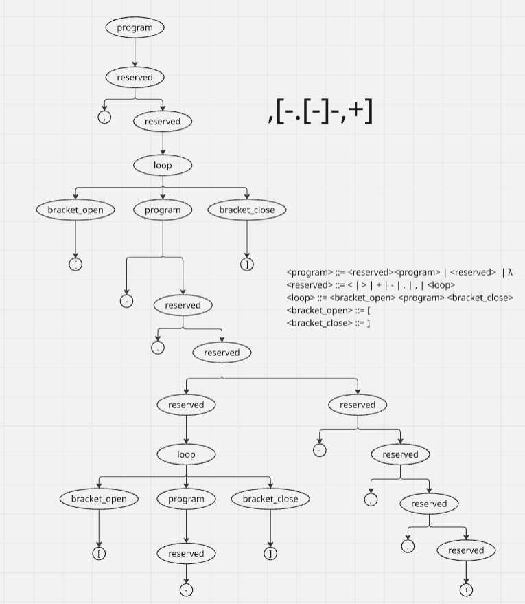

# TP1
Opciones de visualización:
- Visualizar en TP1.pdf, con una resolucion acceptable [Aquí](./TP1.pdf)
- Descargar el html y abrirlo localmente, con vista detallada [Aquí](./TP1.html)

# TP2
Link al Drive, con el Excel [Aquí](
https://docs.google.com/spreadsheets/d/19aTSzIjQNs6RBNJFz0bftTlqKr-uWbohbBZnxmP0-r0/edit?gid=0#gid=0)

# TP3
Link to Archivo [Aquí](
https://docs.google.com/spreadsheets/d/19aTSzIjQNs6RBNJFz0bftTlqKr-uWbohbBZnxmP0-r0/edit?gid=0#gid=0)

# TP4
### Diagrama Sintáctico

### Arbol Sintáctico

palabra derivada 

``,[-.[-]-,+] ``

